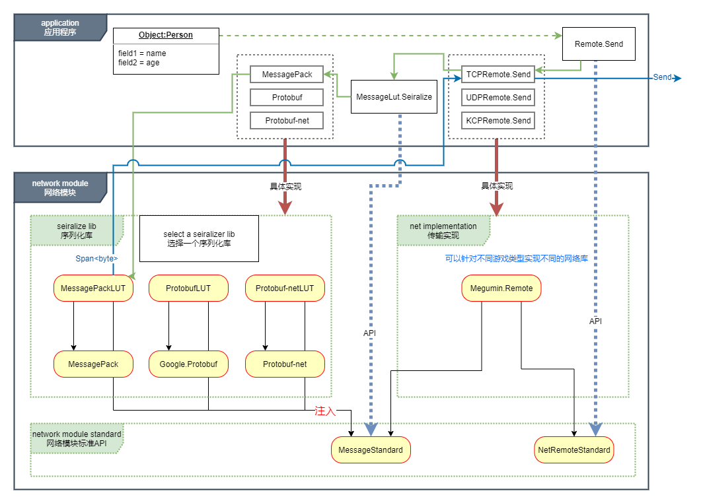

# 这是什么？  
这是一个 ~~简单易用的~~ 网络库。  
这是一个网络模块的通用解决方案。设计目的为应用程序网络模块提供统一的HighLevel接口。 

整个类库被拆分为多个dll。**简单来说：NetRemoteStandard.dll是标准，里面只有接口定义；Megumin.Remote.dll是一种实现。类比于dotnetStandard和dotnetCore的关系。** 
> 为什么要拆分为多个dll？  
> 具体实现可能需要依赖很多其他dll，而接口定义并不需要这些依赖。对于只想使用接口，自定义实现的用户来说，引入额外的依赖是不必要的。例如MessageStandard，用户仅引用自己选择的序列化库即可，而不必引用多个序列化库。    

# [Dll依赖关系与架构](Image/项目结构.png)


---
---


# 它是开箱即用的么？
是的，使用Nuget获取Megumin.Remote。但是注意，需要搭配序列化库，不同的序列化库可能有额外的要求。  
~~由于使用了C# 7.3语法，在unity中如果使用源码至少需要2018.3。~~  
目标框架netstandard2.1，在unity中建议unity版本2021.2以上。过小的版本可以使用源码，但需要自行解决依赖关系。

# UPM Package
## Install via git URL


or add `"com.megumin.net": "https://github.com/KumoKyaku/Megumin.Net.git?path=UnityPackage/Packages/Net"` to `Packages/manifest.json`.

>If you want to set a target version, uses the `*.*.*` release tag so you can specify a version like `#2.1.0`. For example `https://github.com/KumoKyaku/Megumin.Net.git?path=UnityPackage/Packages/Net#2.1.0`.

# 快速入门
- [bilibili视频教程](https://www.bilibili.com/video/BV1We4y1J7EU/)    
  [](https://www.bilibili.com/video/BV1We4y1J7EU/)   


---
---

# 优势
- 支持Tcp，Udp，Kcp。
- 使用内存池和多线程处理收发，可配置线程调度，无需担心网络模块性能问题。
- 内置Rpc。
- 可以搭配不同的序列化类库，甚至不用序列化库。
- **AOT/IL2CPP可用。**
- 可重写的消息管线，专业程序员可以针对具体功能进一步优化。
- 接口分离。[[Dependency injection]](https://en.wikipedia.org/wiki/Dependency_injection) 应用程序可以仅使用NetRemoteStandard.dll编码，然后使用Megumin.Remote.dll的具体实现类注入，当需要切换协议或者序列化类库时，应用程序逻辑无需改动。
- IOCP开销和消息调度转发延迟之间有很好的平衡。
- 自定义MiniTask池,针对网络功能对Task重新实现，性能更高，仅初始化时alloc。
- 支持`Span<T>`。使用[`System.IO.Pipelines`](https://www.cnblogs.com/xxfy1/p/9290235.html)作为高性能IO缓冲区。
- 纯C#实现，这是学习网络功能一个好的起点。
- 3.0 版本 API设计经过真实业务需求改良。
- **`MIT许可证`**
  
# 劣势
- ~~目前为止类库还很年青，没有经过足够的商业项目测试。~~ 
- 不持支 WebGL Networking
- 对于非程序人员仍然需要一些学习成本。独立游戏作者用起来还是有一定难度的。
+ [类库没有解决操作系统的时间精度问题。](https://stackoverflow.com/questions/6254703/thread-sleep-for-less-than-1-millisecond)这个问题非常复杂，需要专人定制。

---
---

# 核心方法3个

设计原则：最常用的代码最简化，复杂的地方都封装起来。  
`发送一个消息，并等待一个消息返回` 是类库的全部内容。 

---
## 1. [ISendAsyncable.SendAsync](Image/callstep.png)
从结果值返回异常是有意义的：  
- 省去了try catch ,写法更简单，避免try catch 控制流。（注意，没有提高处理异常的性能）
- 用来支持异常在分布式服务器中传递。  

```cs
///实际使用中的例子

IRemote remote = new TCPRemote(); ///省略连接代码……
public async void TestSend()
{
    Login login = new Login() { Account = "LiLei", Password = "HanMeiMei" };
    ///                                         泛型类型为期待返回的类型
    var (result, exception) = await remote.SendAsync<LoginResult>(login);
    ///如果没有遇到异常，那么我们可以得到远端发回的返回值
    if (exception == null)
    {
        Console.WriteLine(result.IsSuccess);
    }
}
```

---
## 2. ISendAsyncable.SendAsyncSafeAwait
方法签名：  

```cs
ValueTask<Result> SendAsyncSafeAwait<Result>(object message, object options = null, Action<Exception> onException = null);  
```

结果值是保证有值的，如果结果值为空或其他异常,触发异常回调函数，不会抛出异常，所以不用try catch。`异步方法的后续部分不会触发`，所以后续部分可以省去空检查。  
（``注意：这不是语言特性，也不是异步编程特性，这依赖于具体Remote的实现，这是类库的特性。如果你使用了这个接口的其他实现，要确认实现遵守了这个约定。``）

```cs
IRemote remote = new TCPRemote(); ///省略连接代码……
public async void TestSend()
{
    Login login = new Login() { Account = "LiLei", Password = "HanMeiMei" };
    ///                                           泛型类型为期待返回的类型
    LoginResult result = await remote.SendAsyncSafeAwait<LoginResult>(login, (ex)=>{});
    ///后续代码 不用任何判断，也不用担心异常。
    Console.WriteLine(result.IsSuccess);
}
```

### **多类型等待与模式匹配**
虽然不推荐一个请求对应多个回复类型，但是某些业务设计仍然有此需求。比如将所有errorcode作为一个独立类型回复，那么一个请求就有可能有对应回复和errorcode两个回复类型。  

*protobuf协议中可以使用 `IMessage接口` 作为等待返回的类型。*

```cs
class ErrorCode{}
class Resp{}
class Req{}

async void Test(IRemote remote){
    Req req = new Req();
    ///泛型中填写所有期待返回类型的基类，然后根据类型分别处理。
    ///如果泛型处仅使用一种类型，那么服务器回复另一种类型时，底层会转换为 InvalidCastException 进如异常处理逻辑。
    var ret = await remote.SendAsyncSafeAwait<object>(req);
    if(ret is ErrorCode ec)
    {

    }
    else if(ret is Resp resp)
    {

    }
}
```

---
## 3. ``ValueTask<object> OnReceive(short cmd, int messageID, object message);``
接收端回调函数

```cs
protected virtual async ValueTask<object> OnReceive(short cmd, int messageID, object message)
{
    switch (message)
    {
        case TestPacket1 packet1:
            Console.WriteLine($"接收消息{nameof(TestPacket1)}--{packet1.Value}"); 
            return null;
        case Login login:
            Console.WriteLine($"接收消息{nameof(Login)}--{login.Account}");
            return new LoginResult { IsSuccess = true };
        case TestPacket2 packet2:
            return new TestPacket1 { Value = packet2.Value };
        default:
            break;
    }
    return null;
}
```

#### 注意：  异步发送方法等待的返回值虽然也是接收到的消息，但是会被分发到异步函数回调中，不会触发本函数。即使异步发送方法没有使用await关键字而导致异步后续没有注册，返回消息也不会触发本函数，返回消息将被忽略。 *（事实上，很难实现找不到异步后续时将消息分发到此函数中。因为不持有返回的Task引用时，想要将消息转送到本回调函数，需要对Task增加额外的标记，生命周期难以控制，控制流会变得更难以理解。详细情况参阅源码RpcCallbackPool.CreateCheckTimeout）*  

---
## 4. 由发送端和消息协议控制的的响应机制
具体响应方式参考`PreReceive`函数源码，参考IPreReceiveable，ICmdOption，SendOption.Echo等。  
Heartbeat，RTT，Timestamp Synchronization等功能都由此机制实现。  

+ 在某些时候，比如测试消息是否正常收发，发送端可能希望远端做出特定方式的响应，比如echo，将消息原样返回。  
  这种需求不是针对某一个特定消息类型的，也不是对于某个消息类型永远做出这样的响应，可能仅仅是针对某个时刻的某条消息。  
  对于这样的需求，在OnReceive函数中实现并不合适，没有办法根据消息类型进行抽象。   
  - 通过CmdID == 1 << 0来实现。发送时指定option参数，option实现ICmdOption，将CmdID传递到底层报头中。
  - 通过IPreReceiveable.PreReceiveType == 1来实现，发送的消息协议实现IPreReceiveable接口，并且PreReceiveType的值等于1。
  - 接收端在PreReceive函数中处理，并决定此消息是否继续传递到OnReceive函数中。
+ 在另一些时候，更通用的是，发送端发出一个消息，但是处于一些特殊原因，不希望将响应函数写在OnReceive函数中。  
  可以通过消息协议继承IAutoResponseable接口实现，并且PreReceiveType == 2。  
  接收端`PreReceive`函数中处理此类消息，并调用GetResponse返回结果到发送端。
    ```cs
    public interface IAutoResponseable : IPreReceiveable
    {
        ValueTask<object> GetResponse(object request);
    }
    ```
  - 比如消息协议是跨项目的，但是OnReceive函数不是。
  - 比如一些简单并且通用的基础函数调用，不想污染OnReceive函数。GetTime,GetSystemInfo等。但又不想将这些功能内置到网络模块中。 

---
---

# 重要
- **线程调度**  
  Remote 使用```bool UseThreadSchedule(int rpcID, short cmd, int messageID, object message)```函数决定消息回调函数在哪个线程执行，true时所有消息被汇总到Megumin.ThreadScheduler.Update。  
  你需要轮询此函数来处理接收回调，它保证了按接收消息顺序触发回调（如果出现乱序，请提交一个BUG）。Unity中通常应该使用FixedUpdate。  
  ``如果你的消息在分布式服务器之间传递，你可能希望消息在中转进程中尽快传递，那么`` false时接收消息回调使用Task执行，不必在轮询中等待，但无法保证有序，鱼和熊掌不可兼得。   

    ```cs
    ///建立主线程 或指定的任何线程 轮询。（确保在unity中使用主线程轮询）
    ///ThreadScheduler保证网络底层的各种回调函数切换到主线程执行以保证执行顺序。
    ThreadPool.QueueUserWorkItem((A) =>
    {
        while (true)
        {
            ThreadScheduler.Update(0);
            Thread.Yield();
        }
    });
    ```

- **``Message.dll``**  
  [（AOT/IL2CPP）当序列化类以dll的形式导入unity时（因为有时会将消息类库设计成unity外的共享工程），必须加入link文件，防止序列化类属性的get,set方法被il2cpp剪裁。](https://docs.unity3d.com/Manual/IL2CPP-BytecodeStripping.html)**``重中之重，因为缺失get,set函数不会报错，错误通常会被定位到序列化库的多个不同位置（我在这里花费了16个小时）。``** 

        <linker>
            <assembly fullname="Message" preserve="all"/>
        </linker>
  
# 报头  
  + Udp,Kcp 不用处理粘包，所以报头不含有TotalLength，TotalLength改为1字节的消息种类识别码，具体参照源码。   
  + 使用小端字节序写入报头。BinaryPrimitives.WriteInt32LittleEndian。  
  + TotalLength = 4 + 4 + 2 + 4 + bodyLength。  

  | TotalLength（value including total length 4 byte） | RpcID        | CMD          | MSGID        | Body          |
  | -------------------------------------------------- | ------------ | ------------ | ------------ | ------------- |
  | 总长度(值包含总长度自身的4个字节)                  |              |              | 消息ID       | 消息正文      |
  | Int32（int）                                       | Int32（int） | Int16(short) | Int32（int） | byte[]        |
  | 4byte                                              | 4byte        | 2byte        | 4byte        | byte[].Lenght |

- **与其他语言或者网络库对接**  
**`当服务器不使用本库，或者不是C#语言时。满足报头格式，即可支持本库所有特性。`**    

# ~~MessagePipeline是什么？~~
~~MessagePipeline 是 Megumin.Remote 分离出来的一部分功能。   
它也可以理解为一个协议栈。   
它决定了消息收发具体经过了哪些步骤，可以自定义MessagePipeline并注入到Remote,用来满足一些特殊需求。  
例如：~~
- ~~消息反序列化前转发。~~
- ~~使用返回消息池来实现接收过程构造返回消息实例无Alloc（这需要序列化类库的支持和明确的生命周期管理）。  
``你可以为每个Remote指定一个MessagePipeline实例，如果没有指定，默认使用MessagePipeline.Default。``~~

2.0 版本删除MessagePipeline，改为多个Remote实现中可重写的函数，在工程实践中发现，将消息管线与Remote拆离没有意义，是过度设计。如果需要同时定制3个协议Remote的管线，可以由用户自行拆分，框架不做处理。  

`人生就是反反复复。`  
3.0版本决定改回最开始设计，第一版本的设计思路更好。  
经过工程实践发现，2.0的设计并不方便重写，用户相同的重写代码在针对不同的协议时需要重写多份，分别从TcpRemote，UdpRemote，Kcpremote继承，每次修改时也要同时修改多份，十分笨重。  
用户主要重写接收消息部分和断线部分，断线重连部分针对不同协议处理方式也不同。  
所以将Transport和IDisconnectHandler从Remote拆分出来。  
本质上说，3.0的Remote等于1.0的MessagePipeline。3.0的Transport等于1.0的Remote。  

# MessageLUT是什么？
MessageLUT（Message Serialize Deserialize callback look-up table）是MessageStandard的核心类。MessagePipeline 通过查找MessageLUT中注册的函数进行序列化。**``因此在程序最开始你需要进行函数注册``**。  

通用注册函数：  
```CS
void RegistIMeguminFormatter<T>(KeyAlreadyHave key = KeyAlreadyHave.Skip) where T : class, IMeguminFormatter, new() 
```

序列化类库的中间件基于MessageLUT提供多个简单易用的API，自动生成序列化和反序列化函数。需要为协议类添加一个MSGIDAttribute来提供查找表使用的ID。因为一个ID只能对应一组序列化函数，因此每一个协议类同时只能使用一个序列化库。  

```cs
namespace Message
{
    [MSGID(1001)]       //MSGID 是框架定义的一个特性，注册函数通过反射它取得ID
    [ProtoContract]     //ProtoContract     是protobuf-net 序列化库的标志
    [MessagePackObject] //MessagePackObject 是MessagePack  序列化库的标志
    public class Login  //同时使用多个序列化类库的特性标记，但程序中每个消息同时只能使用一个序列化库
    {
        [ProtoMember(1)]    //protobuf-net  从 1 开始
        [Key(0)]            //MessagePack   从 0 开始
        public string Account { get; set; }
        [ProtoMember(2)]
        [Key(1)]
        public string Password { get; set; }
    }
    [MSGID(1002)]
    [ProtoContract]
    [MessagePackObject]
    public class LoginResult
    {
        [ProtoMember(1)]
        [Key(0)]
        public bool IsSuccess { get; set; }
    }
}
```

- JIT环境下可以直接注册一个程序集  
  
    ```cs
    private static async void InitServer()
    {
        //MessagePackLUT.Regist(typeof(Login).Assembly);
        Protobuf_netLUT.Regist(typeof(Login).Assembly);
        ThreadPool.QueueUserWorkItem((A) =>
        {
            while (true)
            {
                ThreadScheduler.Update(0);
                Thread.Yield();
            }
    
        });
    }
    ```
- `AOT/IL2CPP` 环境下需要`显示`通过泛型函数注册每一个协议类，以确保在`AOT/IL2CPP编译器`在静态分析时生成对应的泛型函数。    
    ```cs
    public void TestDefine()
    {
        Protobuf_netLUT.Regist<Login>();
        Protobuf_netLUT.Regist<LoginResult>();
    }
    ```
    **注意：**  
    `序列化库`使用`代码生成器生成代码`,是生成类型实际的序列化函数。  
    而这里是为了静态分析时生成序列化类库通用API的泛型函数。   
    > 例如：```ProtoBuf.Serializer.Serialize<T>()``` 生成为```ProtoBuf.Serializer.Serialize<Login>()```   
    
    两者不相同。

# 支持的序列化库(陆续添加中)

每个库有各自的限制，对IL2CPP支持也不同。框架会为每个支持的库写一个继承于MessageStandard/MessageLUT的新的MessageLUT.  
由于各个序列化库对`Span<byte>`的支持不同，所以中间层可能会有轻微的性能损失.

对于序列化函数有三种形式：
1. 代码生成器生成代码   
   { protobuf ，[MessagePack mpc.exe](https://github.com/neuecc/MessagePack-CSharp#pre-code-generationunityxamarin-supports) }
2. 通过反射每个字段组合   
   { protobuf-net .NET Standard 1.0 }
3. JIT 生成  
   { protobuf-net ， MessagePack }

## [protobuf-net](https://github.com/mgravell/protobuf-net)
- IL2CPP 请使用[.NET Standard 1.0](https://github.com/mgravell/protobuf-net#supported-runtimes)，其他运行时可能无法构建。虽然是反射模式，但是对于客户端来说并没有性能问题，于此同时服务器可以使用 .NET Standard 2.0。  
  unity无头模式服务器应该考虑其他库。

## [protobuf](https://github.com/protocolbuffers/protobuf)

## [MessagePack](https://github.com/neuecc/MessagePack-CSharp)

---
---

# 一些细节
- `RPC功能`：保证了请求和返回消息一对一匹配。发送时RPCID为负数，返回时RPCID*-1 为正数，用正负区分上下行。  
  + 0和int.minValue为无效RPCID值。  
  + 0是普通消息。int.minValue是广播消息。
- `内存分配`：通过使用`内存池`，减少alloc。
- ~~[发送过程数据拷贝](#jump1)了2次，接收过程数据无拷贝(各个序列化类库不同)。~~ 2.0版本中做了调整。
- `内存池`：标准库内存池，`ArrayPool<byte>.Shared`。
- `序列化`：使用type做Key查找函数。
- `反序列化`：使用MSGID(int)做Key查找函数。
- 内置了string,int,long,float,double,DateTimeOffset等类型序列化支持，即使不使用序列化类库，也可以直接发送它们。
- `MessageLUT.Regist<T>`函数手动添加其他类型。  
  如果不想用序列化库，也可以使用Json通过string发送。
- `消息类型`：尽量不要使用大的自定义的struct，整个序列化过程`有可能`导致多次装箱拆箱。在参数传递过程中还会多次复制，性能比class低。
- 多目标框架支持 `<TargetFrameworks>netstandard2.0;netstandard2.1;net5;net6</TargetFrameworks>`。


# 3.0版本
- Remote：负责序列化和Rpc，消息接收。  
- Transport：负责传输层数据收发。  
- IDisconnectHandler： 负责断线处理。  


# `时间和空间上的折衷`

~~序列化之前无法确定消息大小，因此需要传递一个足够大的buffer到序列化层。如果不进行拷贝，直接将整个大buffer传递到发送层，由于异步特性，无法准确得知发送过程的生命周期，可能在发送层积累大量的大buffer，严重消耗内存，因此类库在序列化层和发送层之间做了一次拷贝。~~  
2.0版本 使用`IBufferWriter<byte>`和`ReadOnlySequence<byte>`解决了这个问题，效率更高。

# 效率

- 0.2版本。没有精确测试，Task的使用确实影响了一部分性能，但是是值得的。经过简单本机测试单进程维持了15000+ Tcp连接。
- 2.0版本性能可能会比之前版本低一些，还没有实际测试。
- 3.0版本性能得到极大优化，超过历史版本。性能上可以满足99%的项目。  
  本机测试Tcp峰值达到15000+连接，收发26000 0000 字节每秒，网络模块性能已经不在是问题。  
  Kcp只能3000~5000连接，再多就会爆内存，具体要能维持多少连接，要看数据流量。  

# 其他信息

这是写类库途中总结到的知识或者猜测：
- public virtual MethodInfo MakeGenericMethod(params Type[] typeArguments);  
  在IL2CPP下可用，但是不能创造新方法。如果这个泛型方法在编译期间确定，那么此方法可用。否则找不到方法。
- IL2CPP不能使用dynamic关键字。
- **异步编程两个核心关键字理解**：  
    + await == UnsafeOnCompleted == 将下文代码包装成回调函数注册到Task中。  
    记住 await 时才调用 UnsafeOnCompleted即可。
    + async == AsyncTaskMethodBuilder.Create().Task,并在方法末尾SetResult。  
    async是隐藏的生成一个Task/ValueTask。

**Megumin.Remote是以MMORPG为目标实现的。对于非MMORPG游戏可能不是最佳选择。** 在遥远的未来也许会针对不同游戏类型写出NetRemoteStandard的不同实现。

# 工程实现需要，但本库没有实现的功能
- 同时监听IPV4,IPV6。
- 同时监听Tcp,Udp。
- 同时监听多个端口，用于实现负载均衡。
- 
# internal buffer / kernel buffer
- [**`Where the data stores before we invoke 'socket.read(buffer, offset, count)'?`**](https://stackoverflow.com/questions/59018603/where-the-data-stores-before-we-invoke-socket-readbuffer-offset-count/59024582#59024582)
- [**`Doubt regarding Winsock Kernel Buffer and Nagle algorithm`**](https://stackoverflow.com/questions/1017507/doubt-regarding-winsock-kernel-buffer-and-nagle-algorithm/1017565#1017565)
- [internal winsock buffers](https://forums.codeguru.com/showthread.php?429350-internal-winsock-buffers)  
- [Large TCP kernel buffering cause application to fail on FIN](https://stackoverflow.com/questions/74883959/large-tcp-kernel-buffering-cause-application-to-fail-on-fin)
- [Should I send data in chunks, or send it all at once?](https://stackoverflow.com/questions/42258274/should-i-send-data-in-chunks-or-send-it-all-at-once/42260182#42260182)
- [网络收发过程中，缓冲区位置在哪里？](https://www.jianshu.com/p/9bf818aaa82d)


---
---

# 友情链接
- [Megumin.Explosion](https://github.com/KumoKyaku/Megumin.Explosion) Megumin系列类库的最底层基础库，Megumin的其他库都有可能需要引用它。
- [Megumin.GameFramework](https://github.com/KumoKyaku/Megumin.GameFramework) Megumin系列的业务逻辑类库。
+ [Kcp](https://github.com/KumoKyaku/KCP) 类库所依赖的Kcp实现。


# 参考
- [**Windows TCP 功能说明**](https://learn.microsoft.com/zh-cn/troubleshoot/windows-server/networking/description-tcp-features)
- [IO 多路复用](https://mp.weixin.qq.com/s/YdIdoZ_yusVWza1PU7lWaw)  [【备用链接】](https://zhuanlan.zhihu.com/p/359794948)  
- [Socket缓冲区以及阻塞模式详解](http://c.biancheng.net/view/2349.html)
  
+ [TCP 拥塞控制详解](https://zhuanlan.zhihu.com/p/144273871) 
+ [**TCP的发送缓冲区和接收缓冲区**](https://www.cnblogs.com/csiwei-229958907/articles/13530531.html)
+ [TCP Send函数的阻塞和非阻塞，以及TCP发送数据的异常情况](https://www.cnblogs.com/maji233/p/11465609.html)
  
- [介绍 KCP：新的低延迟、安全网络堆栈](https://www.improbable.io/blog/kcp-a-new-low-latency-secure-network-stack) SpatialOS 的官网有几个协议的详细评测
- [MessagePack for C# v2, new era of .NET Core(Unity) I/O Pipelines](https://neuecc.medium.com/messagepack-for-c-v2-new-era-of-net-core-unity-i-o-pipelines-6950643c1053)  优化中的一些技巧和问题.
- [IOCP(I/O Completion Ports)](https://www.cnblogs.com/cdaniu/p/15782962.html)
- [IOCP threads - Clarification?](https://stackoverflow.com/questions/28690815/iocp-threads-clarification)
- [Understanding Worker Thread And I/O Completion Port (IOCP)](https://www.c-sharpcorner.com/article/understanding-worker-thread-and-io-completion-port-iocp/)
  
+ [C++11中的线程是系统级的还是用户级的呢 比如说thread？](https://www.zhihu.com/question/365982400/answer/1007702207)
+ [Is the thread created in C# user level or kernel level?](https://stackoverflow.com/questions/49524899/is-the-thread-created-in-c-sharp-user-level-or-kernel-level)

- [Unity网络代码](https://docs-multiplayer.unity3d.com/netcode/current/about)
- [Unity网络代码路线图](https://portal.productboard.com/36ukwpc4kysiqwfanhjdglcd/tabs/30-netcode-for-gameobjects)

+ [clumsy](https://github.com/jagt/clumsy) 能在 Windows 平台下人工造成不稳定的网络状况，方便你调试应用程序在极端网络状况下的表现。


