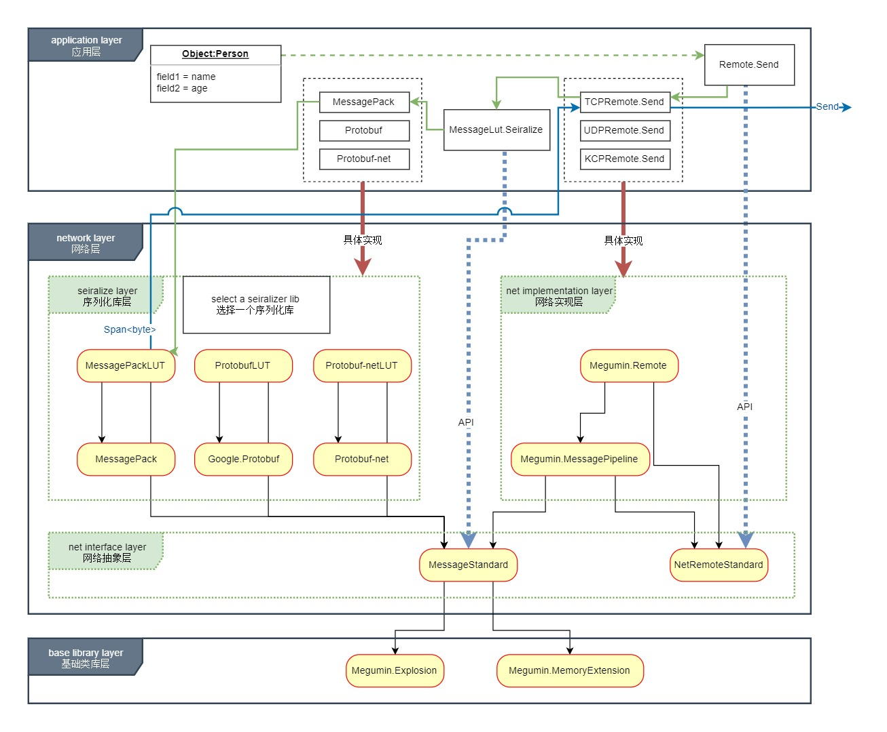

# 这是什么？  
  这是一个 ~~简单易用的~~ 网络库。  
  这是一个网络层的通用解决方案。设计目的为应用程序网络层提供统一的接口。 

  整个类库被拆分为多个dll。**简单来说：NetRemoteStandard.dll是标准，Megumin.Remote.dll是实现。类比于dotnetStandard和dotnetCore的关系。** 


# [Dll依赖关系与架构](Image/dependencies.jpg)


---
---


# 它是开箱即用的么？
是的，使用Nuget获取Megumin.Remote。但是注意，需要搭配序列化库，不同的序列化库可能有额外的要求。  
由于使用了C# 7.3语法，在unity中如果使用源码至少需要2018.3。

# [``开发路线图``](https://trello.com/b/s84Jn7hW/meguminnet)

# 优势
- 使用内存池和多线程高效收发，可配置线程调度，无需担心网络层性能问题。
- 高度封装，无需关心通讯协议、RPC。
- 可以搭配不同的序列化类库，甚至不用序列化库。
- **AOT/IL2CPP可用。** Unity玩家的福音。
- 高度可配置的消息管线，专业程序员可以针对具体功能进一步优化。
- 接口分离。[[Dependency injection]](https://en.wikipedia.org/wiki/Dependency_injection) 应用程序可以使用NetRemoteStandard.dll编码，然后使用Megumin.Remote.dll的具体实现类注入，当需要切换协议或者序列化类库时，应用程序逻辑无需改动。
- 高并发分布式模式中，IOCP开销和消息调度转发延迟之间有很好的平衡
- 自定义MiniTask池,针对网络功能对Task重新实现，性能更高，alloc非常低。
- 支持`Span<T>`
- 纯C#实现，这是学习网络功能一个好的起点
- **`MIT许可证`**。开源千秋万代，闭源死路一条。
  
# 劣势
- 目前为止类库还很年青，没有经过足够的测试
- 对于非程序人员仍然需要一些学习成本
- API设计仍待生产环境验证


---
---

# 核心方法3个

设计原则：最常用的代码最简化，复杂的地方都封装起来。  
发送一个消息，等待一个消息返回。  

---
## IRpcSendMessage.SendAsync
从结果值返回异常是有意义的：1.省去了try catch ,写法更简单（注意，没有提高处理异常的性能）2.用来支持异常在分布式服务器中传递，避免try catch 控制流。

```cs
///实际使用中的例子

IRemote remote = new TCPRemote(); ///省略连接代码……
public async void TestSend()
{
    Login login = new Login() { Account = "LiLei", Password = "HanMeiMei" };
    ///                                         泛型类型为期待返回的类型
    var (result, exception) = await remote.SendAsync<LoginResult>(login);
    ///如果没有遇到异常，那么我们可以得到远端发回的返回值
    if (exception == null)
    {
        Console.WriteLine(result.IsSuccess);
    }
}
```

---
## ISafeAwaitSendMessage.SendAsyncSafeAwait
方法签名： IMiniAwaitable<RpcResult> SendAsyncSafeAwait<RpcResult>(object message, Action<Exception> OnException = null);  
结果值是保证有值的，如果结果值为空或其他异常,触发异常回调函数，不会抛出异常，所以不用try catch。`异步方法的后续部分不会触发`，所以后续部分可以省去空检查。  
（``注意：这不是语言特性，也不是异步编程特性，这依赖于具体Remote的实现，这是类库的特性。如果你使用了这个接口的其他实现，要确认实现遵守了这个约定。``）

```cs
IRemote remote = new TCPRemote(); ///省略连接代码……
public async void TestSend()
{
    Login login = new Login() { Account = "LiLei", Password = "HanMeiMei" };
    ///                                         泛型类型为期待返回的类型
    LoginResult result = await remote.SendAsyncSafeAwait<LoginResult>(login);
    ///后续代码 不用任何判断，也不用担心异常。
    Console.WriteLine(result.IsSuccess);
}
```

---
## ``public delegate ValueTask<object> ReceiveCallback (object message,IReceiveMessage receiver);``
接收端回调函数

```cs
public static async ValueTask<object> DealMessage(object message,IReceiveMessage receiver)
{
    switch (message)
    {
        case TestPacket1 packet1:
            Console.WriteLine($"接收消息{nameof(TestPacket1)}--{packet1.Value}"); 
            return null;
        case Login login:
            Console.WriteLine($"接收消息{nameof(Login)}--{login.Account}");
            return new LoginResult { IsSuccess = true };
        default:
            break;
    }
    return null;
}
```

### 注意：  
异步发送方法等待的返回值虽然也是接收到的消息，但是会被直接发送到异步函数回调中，不会触发本函数。即使异步发送方法没有使用await关键字而导致被同步调用，返回消息也不会触发本函数，返回消息将被忽略。 *（事实上，很难实现同步调用，并且不持有返回的Task引用时，将消息转送到本回调函数，需要对MiniTask增加额外的标记，生命周期难以控制，控制流会变得更难以理解。详细情况参阅源码RpcCallbackPool.CreateCheckTimeout）*  

---
---

# 重要
- **线程调度**  
  Remote 使用MessagePipeline.Post2ThreadScheduler标志决定消息回调函数在哪个线程执行，true时所有消息被汇总到Megumin.ThreadScheduler.Update。  
  你需要轮询此函数来处理接收回调，它保证了按接收消息顺序触发回调（如果出现乱序，请提交一个BUG）。Unity中通常应该使用FixedUpdate。  
  ``如果你的消息在分布式服务器之间传递，你可能希望消息在中转进程中尽快传递，那么`` false时接收消息回调使用Task执行，不必在轮询中等待，但无法保证有序，鱼和熊掌不可兼得。   
  
  **你也可以重写MessagePipeline.Push精确控制每个消息的行为**
    ```cs
    ///建立主线程 或指定的任何线程 轮询。（确保在unity中使用主线程轮询）
    ///ThreadScheduler保证网络底层的各种回调函数切换到主线程执行以保证执行顺序。
    ThreadPool.QueueUserWorkItem((A) =>
    {
        while (true)
        {
            ThreadScheduler.Update(0);
            Thread.Yield();
        }
    });
    ```

- **``Message.dll``**  
  [（AOT/IL2CPP）当序列化类以dll的形式导入unity时，必须加入link文件，防止序列化类属性的get,set方法被il2cpp剪裁。](https://docs.unity3d.com/Manual/IL2CPP-BytecodeStripping.html)**``重中之重，因为缺失get,set函数不会报错，错误通常会被定位到序列化库的多个不同位置（我在这里花费了16个小时）。``** 

        <linker>
            <assembly fullname="Message" preserve="all"/>
        </linker>

# MessagePipeline是什么？
MessagePipeline 是 Megumin.Remote 的一部分功能。  
它决定了消息收发具体经过了那些流程，可以自定义MessagePipeline并注入到Remote,用来满足一些特殊需求。  
如，消息反序列化前转发；使用返回消息池来实现接收过程构造返回消息实例无Alloc（这需要序列化类库的支持和明确的生命周期管理）。  
``你可以为每个Remote指定一个MessagePipeline实例，如果没有指定，默认使用MessagePipeline.Default。``

# MessageLUT是什么？
MessageLUT（Message Serialize Deserialize callback look-up table）是MessageStandard的核心类。MessagePipeline 通过查找MessageLUT中注册的函数进行序列化。**``因此在程序最开始你需要进行函数注册``**。  

通用注册函数：  
```CS
public static void Regist(Type type, int messageID, Serialize seiralize, Deserialize deserilize, KeyAlreadyHave key = KeyAlreadyHave.Skip);  
public static void Regist<T>(int messageID, RegistSerialize<T> seiralize, Deserialize deserilize, KeyAlreadyHave key = KeyAlreadyHave.Skip);  
```

```cs
Regist<TestPacket1>(MSGID.TestPacket1ID, TestPacket1.S, TestPacket1.D);
Regist<TestPacket2>(MSGID.TestPacket2ID, TestPacket2.S, TestPacket2.D);
///5个基础类型
Regist<string>(11, BaseType.Serialize, BaseType.StringDeserialize);
Regist<int>(12, BaseType.Serialize,BaseType.IntDeserialize);
```

序列化类库的中间件基于MessageLUT提供多个简单易用的API，自动生成序列化和反序列化函数。你需要为协议类添加一个MSGIDAttribute来提供查找表使用的ID。因为一个ID只能对应一组序列化函数，因此每一个协议类同时只能使用一个序列化库。  

```cs
namespace Message
{
    [MSGID(1001)]       //MSGID 是框架定义的一个特性，注册函数通过反射它取得ID
    [ProtoContract]     //ProtoContract     是protobuf-net 序列化库的标志
    [MessagePackObject] //MessagePackObject 是MessagePack  序列化库的标志
    public class Login  //同时使用多个序列化类库的特性标记，但程序中每个消息同时只能使用一个序列化库
    {
        [ProtoMember(1)]    //protobuf-net  从 1 开始
        [Key(0)]            //MessagePack   从 0 开始
        public string Account { get; set; }
        [ProtoMember(2)]
        [Key(1)]
        public string Password { get; set; }
    }
    [MSGID(1002)]
    [ProtoContract]
    [MessagePackObject]
    public class LoginResult
    {
        [ProtoMember(1)]
        [Key(0)]
        public bool IsSuccess { get; set; }
    }
}
```

- JIT环境下可以直接注册一个程序集  
    
    ```cs
    private static async void InitServer()
    {
        //MessagePackLUT.Regist(typeof(Login).Assembly);
        Protobuf_netLUT.Regist(typeof(Login).Assembly);
        ThreadPool.QueueUserWorkItem((A) =>
        {
            while (true)
            {
                ThreadScheduler.Update(0);
                Thread.Yield();
            }

        });
    }
    ```
- `AOT/IL2CPP` 环境下需要`显示`通过泛型函数注册每一个协议类，以确保在`AOT/IL2CPP编译器`在静态分析时生成对应的泛型函数。    
    ```cs
    public void TestDefine()
    {
        Protobuf_netLUT.Regist<Login>();
        Protobuf_netLUT.Regist<LoginResult>();
    }
    ```
    **注意：**  
    `序列化库`使用`代码生成器生成代码`,是生成类型实际的序列化函数。  
    而这里是为了静态分析时生成序列化类库通用API的泛型函数。   
    > 例如：```ProtoBuf.Serializer.Serialize<T>()``` 生成为```ProtoBuf.Serializer.Serialize<Login>()```   
    
    两者不相同。

# 支持的序列化库(陆续添加中)
每个库有各自的限制，对IL2CPP支持也不同。框架会为每个支持的库写一个继承于MessageStandard/MessageLUT的新的MessageLUT.  
由于各个序列化库对`Span<byte>`的支持不同，所以中间层可能会有轻微的性能损失.

对于序列化函数有三种形式：
1. 代码生成器生成代码   
   { protobuf ，[MessagePack mpc.exe](https://github.com/neuecc/MessagePack-CSharp#pre-code-generationunityxamarin-supports) }
2. 通过反射每个字段组合   
   { protobuf-net .NET Standard 1.0 }
3. JIT 生成  
   { protobuf-net ， MessagePack }

## [protobuf-net](https://github.com/mgravell/protobuf-net)
- IL2CPP 请使用[.NET Standard 1.0](https://github.com/mgravell/protobuf-net#supported-runtimes)，其他运行时可能无法构建。虽然是反射模式，但是对于客户端来说并没有性能问题，于此同时服务器可以使用 .NET Standard 2.0。  
  unity无头模式服务器应该考虑其他库。

## [protobuf](https://github.com/protocolbuffers/protobuf)

## [MessagePack](https://github.com/neuecc/MessagePack-CSharp)


---
---

# 一些细节
- 内置了RPC功能，保证了请求和返回消息一对一匹配。发送时RPCID为正数，返回时RPCID*-1，用正负区分上下行。0和int.minValue为RPCID无效值。
- 内置了内存池，发送过程是全程无Alloc的，接收过程构造返回消息实例需要Alloc。
- [发送过程数据拷贝](#jump1)了2次，接收过程数据无拷贝(各个序列化类库不同)。
- 内置内存池在初始状态就会分配一些内存（大约150KB）。随着使用继续扩大，最大到3MB左右，详细情况参考源码。目前不支持配置大小。
- 序列化时使用type做Key查找函数，反序列化时使用MSGID(int)做Key查找函数。
- 内置了string,int,long,float,double 5个内置类型，即使不使用序列化类库，也可以直接发送它们。你也可以使用MessageLUT.Regist<T>函数手动添加其他类型。  
  如果不想用序列化库，也可以使用Json通过string发送。
- 消息类型尽量不要是大的自定义的struct，整个序列化过程可能会导致多次装箱拆箱。在参数传递过程中还会多次复制，性能比class低很多。
- .NET Standard 2.0 运行时。我还没有弄清楚2.0和2.1意味着什么。如果未来unity支持2.1，那么很可能运行时将切换为2.1，或者同时支持两个运行时。

<span id="jump1"></span>
## 时间和空间上的折衷
序列化之前无法确定消息大小，因此需要传递一个足够大的buffer到序列化层。如果不进行拷贝，直接将整个大buffer传递到发送层，由于异步特性，无法准确得知发送过程的生命周期，可能在发送层积累大量的大buffer，严重消耗内存，因此我们在序列化层和发送层之间做了一次拷贝。

# 效率
没有精确测试，Task的使用确实影响了一部分性能，但是是值得的。经过简单本机测试单进程维持了15000+ Tcp连接。

# 其他信息
写框架途中总结到的知识或者猜测。
- public virtual MethodInfo MakeGenericMethod(params Type[] typeArguments);  
  在IL2CPP下可用，但是不能创造新方法。如果这个泛型方法在编译期间确定，那么此方法可用。否则找不到方法。
- IL2CPP不能使用dynamic关键字。

## **``在1.0.0版本前API可能会有破坏性的改变。``**

严格来说，目前只有TCP协议可以在生产环境使用。  
UDP,KCP存在一些问题,将在今后一段时间完成，但可能是6个月也可能是一年，我有一个需要加班的全职工作，因此我不确定。  

**Megumin.Remote是以MMORPG为目标实现的。对于非MMORPG游戏可能不是最佳选择。** 在遥远的未来也许会针对不同游戏类型写出NetRemoteStandard的不同实现。

# 友情链接
- [Megumin.Explosion](https://github.com/KumoKyaku/Megumin.Explosion) Megumin系列类库的最底层基础库，Megumin的其他库都有可能需要引用它。
- [Megumin.MemoryExtention](https://github.com/KumoKyaku/Megumin.Explosion) Sytem.Memory.dll `Span<T>`系列的扩展库。
